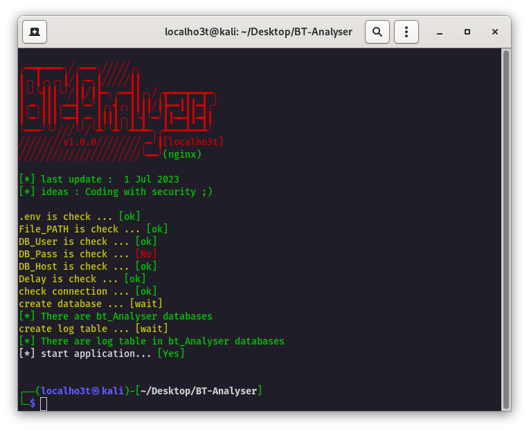
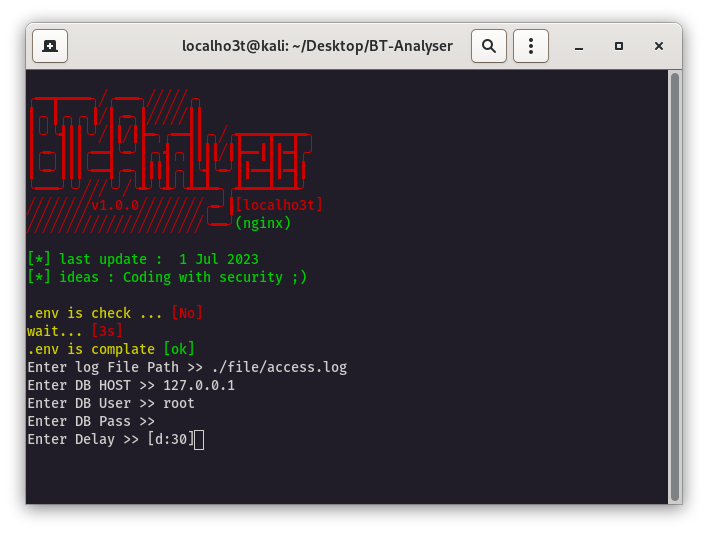
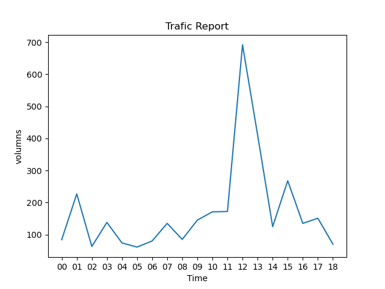
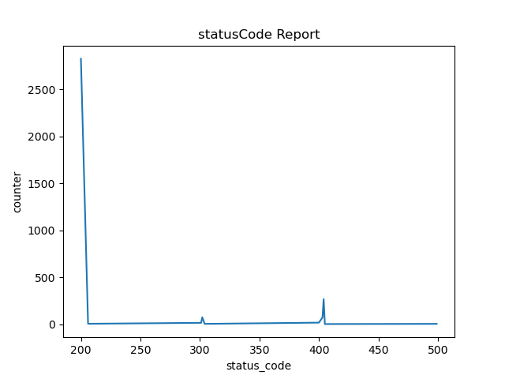
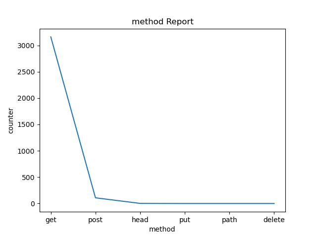
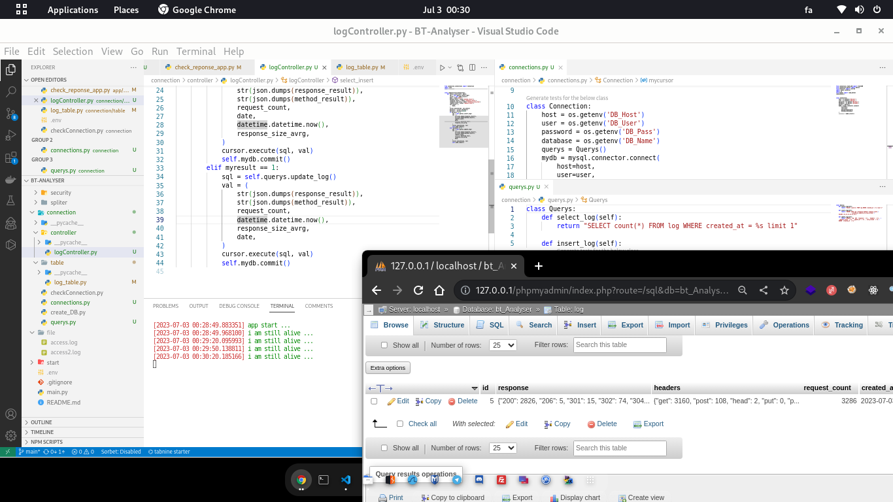

# BT-Analyser



This is a project for reading and analyzing nginx logs that is connected to a unified database, where all the events are stored or updated in it.

## Install

```bash
git clone https://github.com/localho3t/BT-Analyser.git
cd BT-Analyser
pip install -r requirements.txt
python3 main.py
```



## Connect to database

The database used in this software is MySQL. Firstly, you need to create a user in MySQL and then provide the details such as [host, username , password , DB Name] when running the software. Additionally, two other parameters are required in the configuration files which are the log directory address and the repetition rate within a time interval. After entering the information, the program automatically creates the database and its tables and starts working. If you encounter an error, edit the created .env file.

## update v1.2



In this version, an image chart has been added to the project and it displays the hourly traffic chart.

## update v1.2.1

 

In this version, the status code and request method charts have been generated as images for the day.

## License

The BT-Analyser software licensed under the [MIT license](https://opensource.org/licenses/MIT).

# enjoy ;)


